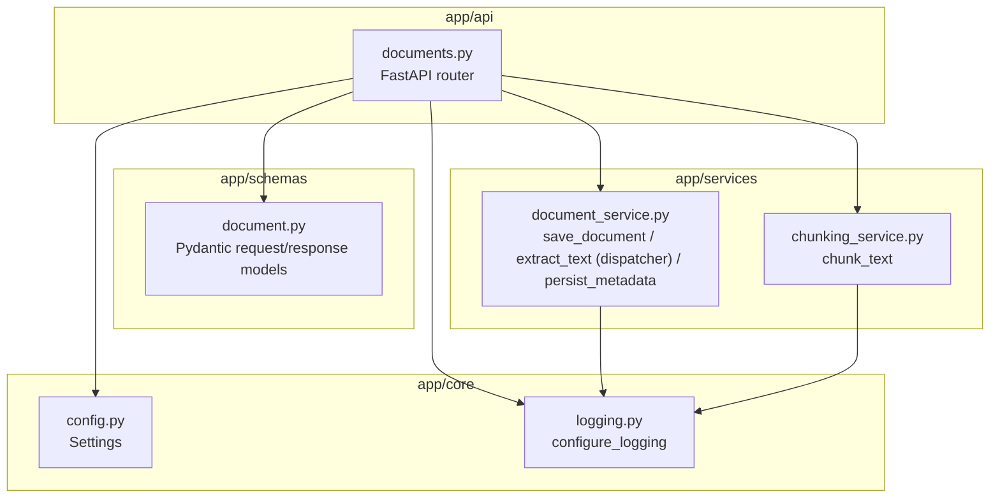
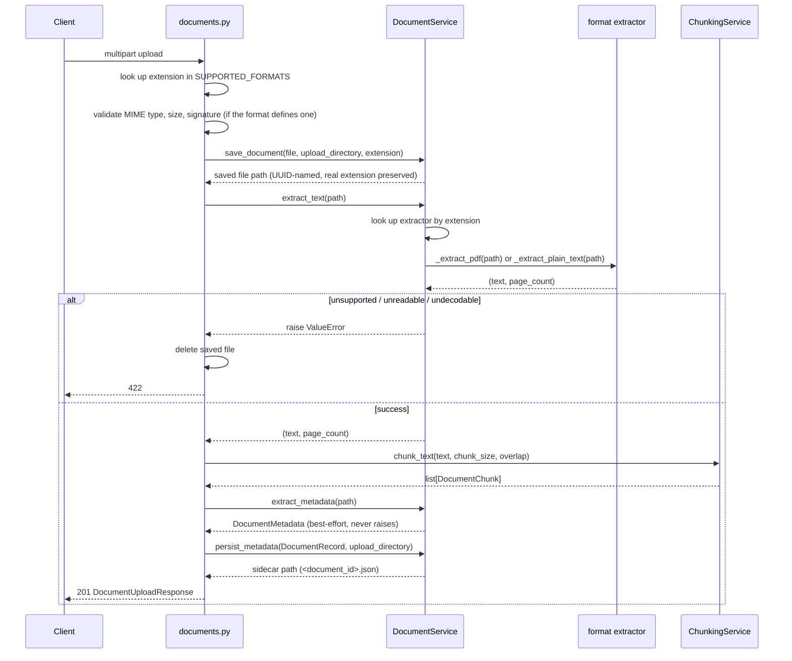

# Architecture

This document describes the system **as it exists today**. It is updated
only when components, responsibilities, or data flow actually change (see
`docs/DECISIONS.md` for why a change was made, and `docs/ROADMAP.md` for
what hasn't been built yet).

## Layering

The codebase is split into four layers with a strict dependency direction:
`api` depends on `services` and `schemas`, `services` depends on nothing
above it, and `core` is shared by everyone.

**Why this split:**

- `api/` only translates HTTP in and out - validation of the *shape* of a
  request, calling a service, mapping results/exceptions to status codes.
  It has no PDF-parsing or filesystem logic in it.
- `services/` holds the actual business logic (how a file is stored, how
  text is extracted, how it's chunked) so it can be tested or reused
  without spinning up HTTP at all. Chunking lives in its own
  `ChunkingService` rather than inside `DocumentService`, since it's a
  distinct responsibility with its own algorithm and config, not tied to
  any particular file format.
- `schemas/` defines the response contract independently of both, so the
  API's public shape doesn't leak internal service types.
- `core/` holds things every layer needs (configuration, logging) without
  those layers needing to know about each other.

This is a deliberate, small-scale version of the classic controller /
service / model split - chosen now because the project already has
validation logic that doesn't belong in a route handler, not because
"layered architecture" is a goal in itself.

## Request flow: `POST /documents/upload`

Validation is intentionally layered defense-in-depth, in this order:
extension -> MIME type -> emptiness -> size -> file signature (only for
formats that define one) -> actual parse. Cheap, client-controllable
checks run first so obviously bad requests fail fast before any file I/O
happens.

## Current constraints (by design, for now)

- **Storage:** local filesystem under `uploads/`, filenames are generated
  UUIDs (never trust user-supplied filenames for paths).
- **Memory:** the full upload is read into memory before validation. Fine
  at current file-size limits (10 MB default); will need streaming if
  large-file support is added later.
- **State:** extracted text and metadata are persisted as a JSON sidecar
  file (`uploads/<document_id>.json`) via `DocumentRecord` +
  `DocumentService.persist_metadata`. This is deliberately not a database
  yet - there's nothing to query across documents until Phase 3 needs it.
- **Formats:** PDF, TXT, Markdown, DOCX, PPTX, and HTML are all
  supported via a registry (`SUPPORTED_FORMATS`, a
  `dict[str, DocumentFormat]`) that both the router (for validation) and
  `DocumentService` (for extraction) read from - every format added
  after the first two (DOCX, PPTX, HTML) required zero router changes,
  confirming the registry design holds up. Text-based formats (TXT,
  Markdown, HTML) have no signature check, since plain text has no
  reliable magic bytes; a mislabeled file that happens to decode as
  UTF-8 would currently be silently accepted. DOCX extraction reads
  paragraph text only - tables and embedded objects are not extracted.
  PPTX is the one format where `page_count` reflects a real pagination
  concept (actual slide count) rather than being hardcoded to 1.
- **Chunking:** `ChunkingService.chunk_text` splits `extracted_text`
  into overlapping, character-bounded chunks (sizes configurable via
  `Settings.chunk_size_chars`/`chunk_overlap_chars`), stored in the same
  JSON sidecar as a `chunks` field on `DocumentRecord`. Character-based,
  not token-based - there's no embedding model yet to make token counts
  meaningful, so no tokenizer dependency was added. Each chunk keeps its
  `start_offset`/`end_offset` into the original text, computed for free
  during chunking and intended for citations once retrieval exists.
- **Metadata:** `DocumentService.extract_metadata` pulls title, author,
  and creation date from PDF/DOCX/PPTX (`pypdf`'s `reader.metadata`,
  `core_properties` for the Office formats); TXT/Markdown/HTML have no
  metadata standard and get an empty `DocumentMetadata`. This is the
  one extraction path in the codebase that's explicitly best-effort - a
  failure here degrades to empty metadata instead of failing the
  upload, since the file already parsed successfully once for text
  extraction. DOCX/PPTX's `created_at` may reflect the authoring tool's
  default template timestamp rather than a real authorship date if the
  document never set one explicitly.

## Where this goes next

Per `docs/ROADMAP.md`, this closes out Phase 2 (Document Processing)
entirely. The next architectural additions are Phase 3:

1. **A real database** - once something needs to query or list across
   documents rather than looking up one JSON file at a time, the sidecar
   files get replaced by a database and likely a `repositories/` layer.
2. **Embeddings** - turning chunks into vectors, likely the point where
   chunk-level metadata (embedding model, vector) gets added to
   `DocumentChunk`. Needs a model/provider decision first - the first
   milestone in this project that introduces an external dependency and
   likely cost, not just an implementation choice.
3. **Retrieval** - a vector store dependency and a query-time service.
4. **RAG / agents** - orchestration on top of retrieval, likely LangGraph.

Each addition should be evaluated against the same question used to build
this layer split: does it belong in `api`, `services`, or `core`, and does
it introduce a new layer only if the existing ones can't reasonably hold
it.
