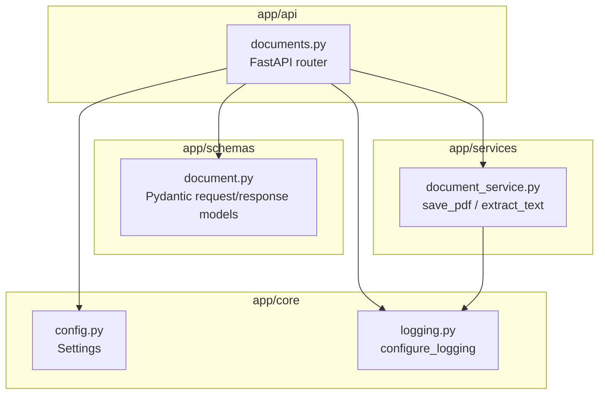
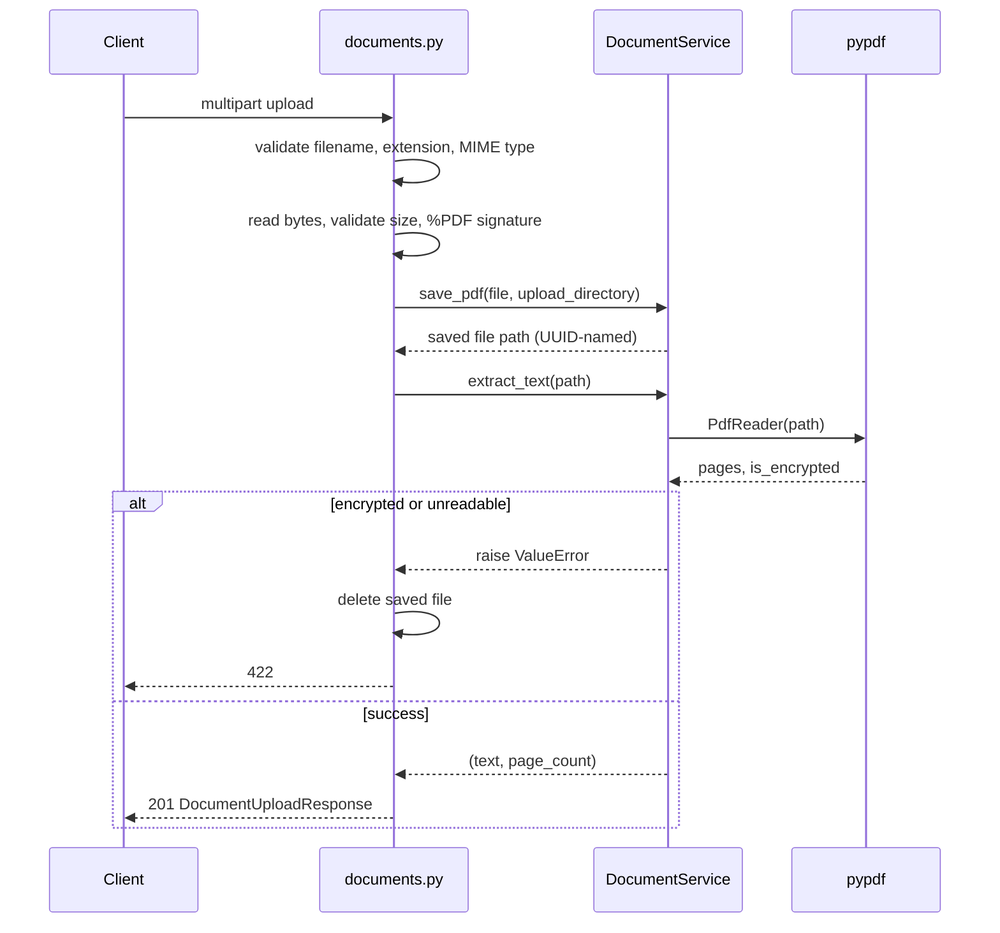

# Architecture

This document describes the system **as it exists today**. It is updated
only when components, responsibilities, or data flow actually change (see
`docs/DECISIONS.md` for why a change was made, and `docs/ROADMAP.md` for
what hasn't been built yet).

## Layering

The codebase is split into four layers with a strict dependency direction:
`api` depends on `services` and `schemas`, `services` depends on nothing
above it, and `core` is shared by everyone.

**Why this split:**

- `api/` only translates HTTP in and out - validation of the *shape* of a
  request, calling a service, mapping results/exceptions to status codes.
  It has no PDF-parsing or filesystem logic in it.
- `services/` holds the actual business logic (how a PDF is stored, how
  text is extracted) so it can be tested or reused without spinning up
  HTTP at all.
- `schemas/` defines the response contract independently of both, so the
  API's public shape doesn't leak internal service types.
- `core/` holds things every layer needs (configuration, logging) without
  those layers needing to know about each other.

This is a deliberate, small-scale version of the classic controller /
service / model split - chosen now because the project already has
validation logic that doesn't belong in a route handler, not because
"layered architecture" is a goal in itself.

## Request flow: `POST /documents/upload`

Validation is intentionally layered defense-in-depth, in this order:
extension -> MIME type -> emptiness -> size -> file signature -> actual
parse. Cheap, client-controllable checks run first so obviously bad
requests fail fast before any file I/O happens.

## Current constraints (by design, for now)

- **Storage:** local filesystem under `uploads/`, filenames are generated
  UUIDs (never trust user-supplied filenames for paths).
- **Memory:** the full upload is read into memory before validation. Fine
  at current file-size limits (10 MB default); will need streaming if
  large-file support is added later.
- **State:** extracted text is computed and returned but not persisted
  anywhere. There is no database yet - see `docs/ROADMAP.md` Phase 2/3 for
  when that changes.
- **Single format:** PDF only. Adding DOCX support should extend
  `DocumentService`, not branch inside the router.

## Where this goes next

Per `docs/ROADMAP.md`, the next architectural additions (each will update
this file when they land) are:

1. **Persistence** - extracted text stored somewhere durable, likely
   introducing a database and a `repositories/` or similar layer.
2. **Chunking + embeddings** - a new service that turns stored text into
   vector-ready chunks.
3. **Retrieval** - a vector store dependency and a query-time service.
4. **RAG / agents** - orchestration on top of retrieval, likely LangGraph.

Each addition should be evaluated against the same question used to build
this layer split: does it belong in `api`, `services`, or `core`, and does
it introduce a new layer only if the existing ones can't reasonably hold
it.
